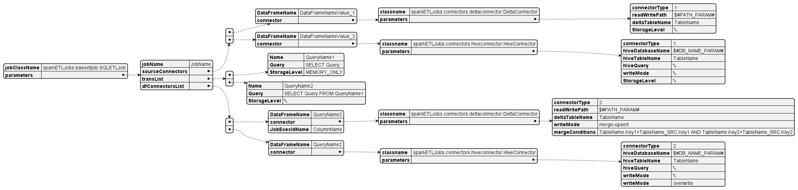

# Spark ETL Framework

## Motivation:
I am assigned to a project to migrate the ETL jobs from DataStage to something open source.
The ETL was written in SQL in ELT style and Datastage is used for staging and workflow management.
After research and lot of discussions we settled on Spark as the ETL engine and AirFlow as the workflow
management tool. 
This package has been developed for the following goals:
- Unifying the ETL jobs development style.
- Making the data engineer to focus only the ETL logic and to fulfil the requirements. 
- Supporting any kind of data lineage to be developed on top of the developed jobs by using open format (json)

## Description:
This package should be used to develop ETL jobs using SQL by writing json files with certain format.
These files should be passed to the engine to parse them and run the logic contained in it.
If anyone needs to write the jobs in python without SQL or mix or even SQL only, class **ETLJob** can be used directly.
If you need to specify the jobs in json files, SQL is your only solution. The json files are being parsed and the logic run using **SQLETLJob**.
The json files format have been developed to map each part of the **ETL** process.
It should contain the following:
- Parameters to be replaced with there values in the runtime.
- ***(E)*** The list of sources and the definition for each. The sources can be specified through connectors.
- ***(T)*** The list of transformation in Spark SQL format to be performed in the sequence of their appearance in the list.
- ***(L)*** The list of targets and the are specified in the same manner as the sources. The connector type is the key for determining if the a certain connector is a source or a target.
Same as above in python code. You will pass list of sources, python functions for transformations with certain signature and list of targets.

## Class Diagram
The following is the class diagram for the developed ETL engine.

## Json diagram 
The following is a graphical representtion for sample json file. This job extract data
from delta table and hive table. It performs two transformation in sequence. It loads the data
in a delta table and hive table.

## JSON fields description:
This section to describe each field in the JSON file:
- **ETL Engine fully qualified class name**: For now the only supported name is "**sparkETLJobs.baseetljob.SQLETLJob**". 
  This field is composite field and contains the following: 
  - **jobName**: The ETL job name.
  - **spark.SparkSessionName**: App name which will be used in creating the SparkSession. It can be the same as the jobName field.
- **sourceConnectors**: This is a list field. It contains list of sources to be used to extract the data.
    Each sourceConnector item contains the following:
  - **DataFrameName**: The name for the dataframe which will be the result of the extraction for this source. It will the name of the temp table name. 
    This name can be used in the transformation queries listed in the transformation part.
  - **Source**: This contains a composite field and its name is a fully qualified class name for the connector to be used to extract the data.
    For now the only available connectors are:
    - "**sparkETLJobs.connectors.deltaconnector.DeltaConnector**"
    - "**sparkETLJobs.connectors.hiveconnector.HiveConnector**"
    - "**sparkETLJobs.connectors.hdfsconnector.HdfsConnector**"
    
    You may add any additional connector by extending "**sparkETLJobs.connectors.abstractconnector.AbstractConnector**".
    This following field are mandatory:
    - **connectorType**: Its value is 1 if this connector is a source and 2 if it is a target.
    - **StorageLevel**: Its value determine the caching behaviour. The value can "DISK_ONLY","DISK_ONLY_2","DISK_ONLY_3","MEMORY_ONLY","MEMORY_ONLY_2","MEMORY_AND_DISK","MEMORY_AND_DISK_2","OFF_HEAP","MEMORY_AND_DISK_DESER","DEFAULT".
      Please refer to the following link to know about the difference [Spark StorageLevel](https://spark.apache.org/docs/3.1.2/api/python/reference/api/pyspark.StorageLevel.html?highlight=storagelevel)
    
    There will additional fields which will depend on the connector class itself.
    For example for the HiveConnector, "hiveDatabaseName" should be specified. Please refer to connector class to know about them.
    

## Files and description

#Example Usage Code
For the SQL and for the python code

#Future work
Interface to generate json files

