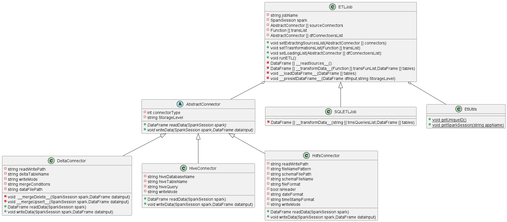

# Spark ETL Framework

## Motivation:
I am assigned to a project to migrate the ETL jobs from DataStage to something open source.
The ETL was written in SQL in ELT style and Datastage is used for staging and workflow management.
After research and lot of discussions we settled on Spark as the ETL engine and AirFlow as the workflow
management tool. 
This package has been developed for the following goals:
- Unifying the ETL jobs development style.
- Making the data engineer to focus only the ETL logic and to fulfil the requirements. 
- Supporting any kind of data lineage to be developed on top of the developed jobs by using open format (json)

## Description:
This package should be used to develop ETL jobs using SQL by writing json files with certain format.
These files should be passed to the engine to parse them and run the logic contained in it.
If anyone needs to write the jobs in python without SQL or mix or even SQL only, class **ETLJob** can be used directly.
If you need to specify the jobs in json files, SQL is your only solution. The json files are being parsed and the logic run using **SQLETLJob**.
The json files format have been developed to map each part of the **ETL** process.
It should contain the following:
- Parameters to be replaced with there values in the runtime.
- ***(E)*** The list of sources and the definition for each. The sources can be specified through connectors.
- ***(T)*** The list of transformation in Spark SQL format to be performed in the sequence of their appearance in the list.
- ***(L)*** The list of targets and the are specified in the same manner as the sources. The connector type is the key for determining if the a certain connector is a source or a target.
Same as above in python code. You will pass list of sources, python functions for transformations with certain signature and list of targets.

## Class Diagram
The following is the class diagram for the developed ETL engine.

## JSON diagram 
The following is a graphical representtion for sample json file. This job extract data
from delta table and hive table. It performs two transformation in sequence. It loads the data
in a delta table and hive table.

## JSON fields description:
This section to describe each field in the JSON file:
- **jobClassName**: The ETL engine fully qualified class name.For now the only supported class name is "**sparkETLJobs.baseetljob.SQLETLJob**". 
- **parameters**: It is composite field which containes the parameters used to initialize an instance from the mentioned job class.
  It containes the following fields: 
  - **jobName**: The ETL job name.
  - **sourceConnectors**: This is a list field. It contains list of sources to be used to extract the data.
    Each sourceConnector item contains the following fields:
    - **DataFrameName**: The name for the dataframe which will be the result of the extraction process for this source. It will be temp table name. 
      This name can be used in the transformation queries listed in the transformation part.
    - **connector**: This contains the following fields:
      - **classname**: The fully qualified class name for the connector to be used to extract the data.
        For now the only available connectors are:
        - "**sparkETLJobs.connectors.deltaconnector.DeltaConnector**"
        - "**sparkETLJobs.connectors.hiveconnector.HiveConnector**"
        - "**sparkETLJobs.connectors.hdfsconnector.HdfsConnector**"
        
        You may add any additional connector by extending "**sparkETLJobs.connectors.abstractconnector.AbstractConnector**".
      - **parameters**: This is a composite field which holds the parameters for the mentioned connector.
        There are main parameters which should present in each connector:
        - **connectorType**: Its value is 1 to indidcate that it is a source.
        - **StorageLevel**: Its value determine the caching behaviour. The value can "DISK_ONLY","DISK_ONLY_2","DISK_ONLY_3","MEMORY_ONLY","MEMORY_ONLY_2","MEMORY_AND_DISK","MEMORY_AND_DISK_2","OFF_HEAP","MEMORY_AND_DISK_DESER","DEFAULT".
          Please refer to the following link to know about the difference [Spark StorageLevel](https://spark.apache.org/docs/3.1.2/api/python/reference/api/pyspark.StorageLevel.html?highlight=storagelevel)
        
        There will be additional fields which will depend on the connector class itself.
        For example for the HiveConnector, "hiveDatabaseName" should be specified. Please refer to connector class to know about them.
  - **transList**: This is a list field. It contains list of transformation to be applied on the sources. Each transformation item contains the following fields:
    - **Name**: The name which will be given to the dataframe produced by the current transformation.
    - **Query**: The SQL query which will perform this transformation.
    - **StorageLevel**: It is the same as described above.
  - **dfConnectorsList**: This is a list field. It contains list of target connectors which will be used to write the result.
    Each item contains the following:
    - **DataFrameName**: Name of the dataframe which will be written.
    - **connector**: It is the same as the connector described above except that the connectorType value is 2.
      This indicates that it is a target connector.
    - **JobExecIdName**: Name of the column which will be added and populated with unique value for the run.

## Files and description

This section will list each file in the repo and a description.
- [Scripts folder](/scripts): It contains the python scripts for this framework:
  - [Spark framework package](scripts/sparkETLJobs): This is the package for the main framework and contains the following files:
    - [baseetljob.py](scripts/sparkETLJobs/baseetljob.py): It contains the base class **ETLJob** for running the ETL logic without using JSON files.
      It also contains a subclass **SQLETLJob** which runs the ETL logic using SQL. The ETL logic will be described using JSON format.
    - [etlutils.py](scripts/sparkETLJobs/etlutils.py): Contains static functions used as utitlity functions in the framework.
    - [strings.py](scripts/sparkETLJobs/strings.py): Can be used to hold any hardcoded strings.
    - [connectors](/scripts/sparkETLJobs/connectors): It is package for the vailable connectors and can be extended to add more. It contains the following:
      - [abstractConnector.py](/scripts/sparkETLJobs/connectors/abstractConnector.py): It contains **AbstractConnector** class which is the base class for all the connectors.
      - [hdfsconnector.py](/scripts/sparkETLJobs/connectors/hdfsconnector.py): It contains **HdfsConnector** connector class for reading and writing files on HDFS.
      - [hiveconnector.py](/scripts/sparkETLJobs/connectors/hiveconnector.py): It contains **HiveConnector** connector class to read and write data to Hive.
      - [deltaconnector.py](/scripts/sparkETLJobs/connectors/deltaconnector.py): It contains **DeltaConnector** connector class to read and write Delta tables.
  - [main_etl_sql_job.py](/scripts/main_etl_sql_job.py): This is the main script which parses the json file and run the ETL logic using the described package.
  - [ETL airflow Utilities](/scripts/etldagutils): It is package for utilities to be used with Airflow. This is not mandatory script to be used with the framework:
    - [dagutils.py](scripts/etldagutils/dagutils.py): It contains functions related to populating parameters to be passed to an Airflow DAG through an input JSON file in conjunction with Airflow variables.

#Example Usage Code
For the SQL and for the python code

#Future work
Interface to generate json files

